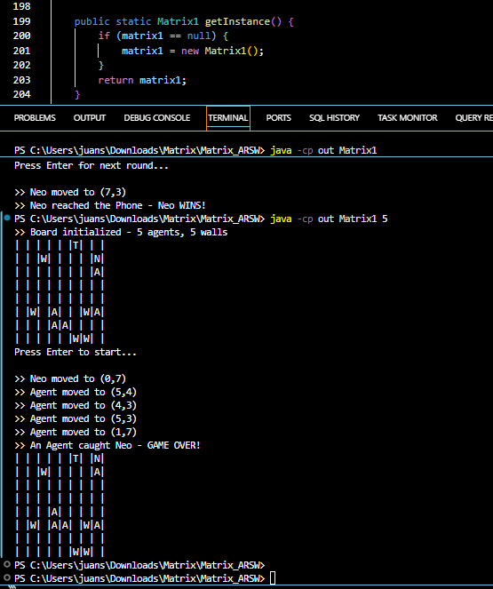
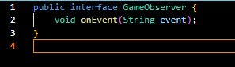
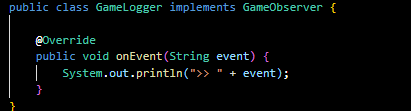
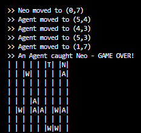
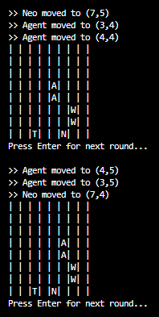
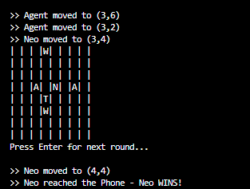
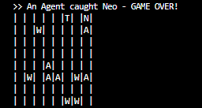

# Matrix_ARSW 
Author: Juan David Gomez Cuellar

## Description

Matrix_ARSW is a round-based console simulation inspired by The Matrix. Neo navigates a randomized 8x8 board trying to reach the Phone while avoiding Agents. Every entity runs on its own thread and all threads move concurrently each round, synchronized by a CyclicBarrier.

The project demonstrates three design patterns applied to a real multi-threaded scenario: Singleton, Observer, and Barrier Synchronization.

## Project Structure

```
Matrix_ARSW/
├── src/
│   └── domain/
│       ├── Matrix1.java       <- Main controller: Singleton + Observer Subject + Barrier
│       ├── Neo.java           <- Neo's thread: moves toward Phone, avoids Agents
│       ├── Agent.java         <- Agent thread: moves toward Neo
│       ├── Phone.java         <- Phone entity (win goal)
│       ├── Wall.java          <- Wall entity (static barrier)
│       ├── GameObserver.java  <- Observer interface
│       └── GameLogger.java    <- Concrete observer (state logger)
└── README.md
```

## Board Symbols

| Symbol | Entity | Description                      |
|--------|--------|----------------------------------|
| N      | Neo    | Player, seeks the Phone          |
| A      | Agent  | Enemy, pursues Neo               |
| T      | Phone  | Win condition / exit point       |
| W      | Wall   | Static barrier blocking movement |

All entities (Neo, Agents, Phone, Walls) are placed at random positions each run.

## How to Compile and Run

Requirements: Java Development Kit 8 or higher.

Compile
```
javac -d out src/domain/*.java
```

Run
```
# Default: 2 agents, 2 walls
java -cp out Matrix1

# Custom: N agents and N walls
java -cp out Matrix1 <N>
```

Each round advances by pressing Enter. The game ends when Neo reaches the Phone (win) or an Agent catches Neo (loss).

## Design Patterns Applied

### 1. Singleton

The Matrix1 class implements the Singleton pattern via getInstance(), ensuring that only one instance of the game board exists throughout the entire execution. All threads, both Neo and every Agent, operate on this single shared matrix. Without this pattern each thread would work on its own board copy, making coordination impossible.



### 2. Observer

Matrix1 acts as the Subject: it maintains a list of GameObserver listeners and calls notifyObservers(event) every time a relevant state change occurs. GameLogger is the Concrete Observer that reacts by printing the event to the console.

| Event fired | Triggered in |
|---|---|
| Board initialized | initialBoard() |
| Neo moved to (x,y) | tryMove() |
| Agent moved to (x,y) | tryMove() |
| Neo reached the Phone - Neo WINS! | gameOver() |
| An Agent caught Neo - GAME OVER! | gameOver() |

The key benefit is decoupling: Matrix1 does not know who listens to its events. Any number of observers (a GUI, a file logger, a test monitor) can be registered via addObserver() without modifying the game logic.







### 3. Barrier Synchronization (CyclicBarrier)

In a concurrent simulation like this one, nothing guarantees that all threads advance at the same pace. Without a synchronization point, a fast thread can execute multiple moves before a slower one executes even one, making the simulation unfair and the board state inconsistent. The CyclicBarrier solves this by acting as a meeting point for all 1 + N threads at the end of every round, so no thread is allowed to start the next round until every other thread has finished its current move. When the last thread arrives at the barrier, the barrier action fires: it shows the updated board and waits for Enter, then all threads are released simultaneously. This guarantees that each round reflects the contribution of every thread before the game state is evaluated.



## Verification

Neo wins when he reaches the Phone.



An Agent catches Neo and the game ends.



## Conclusions

The use of design patterns in concurrent programs is not just organizational, each pattern solves a specific problem that arises directly from multi-threading. Singleton prevents state fragmentation across threads, Observer decouples event production from consumption, and the Barrier guarantees fair and synchronized progression between rounds.

Working with threads in simulations like this one shows that shared mutable state is the root of most concurrency bugs. Proper synchronization through synchronized methods and barriers is what makes the program behave deterministically instead of producing race conditions.

Applying these patterns together demonstrates how real concurrent systems are structured: components that share state must be coordinated, components that emit events should not depend on who listens, and threads that collaborate on a task need meeting points to stay consistent.
